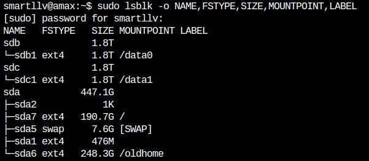

# Install nvidia driver
这篇文章主要总结一下自己在安装nvidia显卡驱动遇到的问题以及相关的解决方案。
**个人经验：不要用官方给的文档来安装显卡驱动，贼坑，不work，这里推荐一个成功安装的[blog](https://gist.github.com/zhanwenchen/e520767a409325d9961072f666815bb8).**

- 环境：新安装的ubuntu 16

## 安装nvidia driver
前面提到，不要用官网给的.run文件来安装driver，而是自己使用linux自带的管理工具来安装，运行:
```bash
sudo apt install nvidia-384 nvidia-modprobe
```

这个过程可能会提示你disable secure boot，选**Disable**。安装好了以后重启，然后进入bios系统disable secure boot。（如果secure boot本身就已经disabled了，这一步可以跳过，但是一定要重启）

**重启后桌面已经登录不进去了，这是正常的，不用管，命令行能进入就行.**
按下`CTRL-ALT-F5`进入系统命令行，然后用用户和密码登录，接着尝试`nvidia-smi`命令，会列出机子上的显卡。

**Bingo!驱动已经安装好了，接下来的都容易很多**

## 安装CUDA
根据自己环境的属性从官网下载run文件（一般amax服务器会自带一个u盘，里面就有这个文件），可以用如下命令用网络下载
```bash
wget https://developer.nvidia.com/compute/cuda/9.0/Prod/local_installers/cuda_9.0.176_384.81_linux-run
```
这个文件包含了3个组件：
1. nvidia driver installer;
2. cuda installer;
3. cuda samples installer.

前面我们已经自己安装了nvidia driver，所以我们只需要安装后面两个就好了。先通过如下命令解压得到上面说的三个组件：
```bash
chmod +x cuda_9.0.176_384.81_linux-run
./cuda_9.0.176_384.81_linux-run --extract=$(pwd) 
```
然后你一般会得到三个可执行文件（对应上面说的三个东东）：
1. NVIDIA-Linux-x86_64-384.81.run（安装driver的，不需要了）
2. cuda-linux.9.0.176-22781540.run（安装cuda的）
3. cuda-samples.9.0.176-22781540-linux.run（安装cuda samples的）

接着安装cuda
```bash
sudo ./cuda-linux.9.0.176-22781540.run
```

这时会有一大堆文档，可以按`CTRL-C`直接跳到末尾，提示你要键入`accept`同意一些条款，键入就是了。
接下来是在自己的`~/.bashrc`添加一些路径和环境变量：

```bash
export PATH=/usr/local/cuda-9.0/bin:$PATH
export LD_LIBRARY_PATH=/usr/local/cuda-9.0/lib64:/usr/local/cuda-9.0/extras/CUPTI/lib64:$LD_LIBRARY_PATH
```

**修改了以后记得`source ~/.bashrc`来应用这些配置**

然后就可以用`nvcc -V`看一下自己的cuda版本了

**下面的步骤都是可选的，最好过一下，验证是否安装成功了**
接着安装cuda samples

```bash
sudo ./cuda-samples.9.0.176-22781540-linux.run
```

接着配置一些文件
```bash
sudo bash -c "echo /usr/local/cuda-9.0/lib64/ > /etc/ld.so.conf.d/cuda.conf"
sudo ldconfig
```
建议reboot（我自己安装时没有reboot也没有报错）

然后编译这些samples
```bash
cd /usr/local/cuda-9.0/samples
sudo make -j32  # 开32个进程进行编译，看自己的机子有多少个CPU
```

编译好了以后
```bash
cd /usr/local/cuda/samples/bin/x86_64/linux/release
./deviceQuery
```

然后会打印一大堆东西，大概看一下没有报错就行

## 安装cudnn 7.0
这个也很简单，因为就是动态链接库，所以只是文件拷贝而已。

现在假定你已经下载好了那个压缩包`cudnn-9.0-linux-x64-v7.tgz`，运行下面的命令：
```bash
sudo tar -xvzf cudnn-9.0-linux-x64-v7.tgz -C /usr/local/
```

`-C`参数指定解压缩的路径。

**好了，至此所有的依赖都安装好了，安装相应的深度学习框架最终验证一下是否还有问题！**

## 安装过程可能遇到的问题

1. 如果你按照官网给的步骤，其中一步还要求你停用`Nouveau driver`，贼烦；

   另外，官网给的run文件同时安装driver、cuda和cuda samples。信我，这个不行，在安装driver这一步就会报`unable to locate kernel source`，刚开始我还以为要特定的kernel，怎么弄都不行。

2. 重装ubuntu后，一些数据盘没有挂载上来（这个问题跟nvidia驱动安装没有关系）

   - 用`sudo lsblk -o NAME,FSTYPE,SIZE,MOUNTPOINT,LABEL`列出所有的磁盘

     

   - 比如上面的结果，因为我的数据盘都已经挂载好了，但关键是左边的dev路径，比如现在`sdb1`分区没有挂载好，可以按如下步骤进行挂载

     ```bash
     sudo mkdir /data0    # 先创建挂载点，就是相应的文件夹
     sudo mount /dev/sdc1 /data0 # 然后挂载
     
     df -h # 这时就会发现数据盘已经挂载好了
     ```

3. 另外，自己的服务器配置好了以后`sudo apt update`有很多更新不了，后面发现是源的问题，可以参考一下这个[blog](<https://blog.csdn.net/xiangxianghehe/article/details/80112149>)


