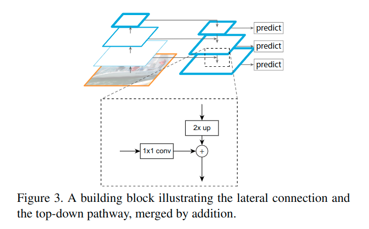
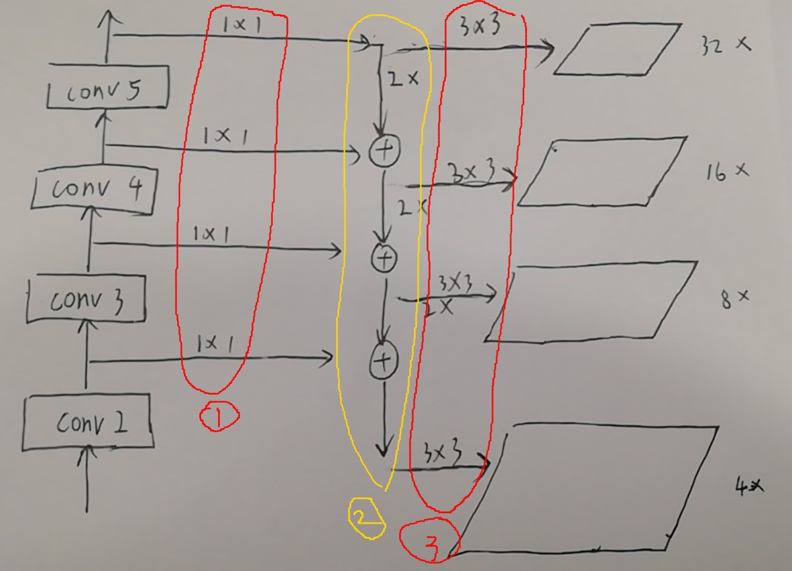
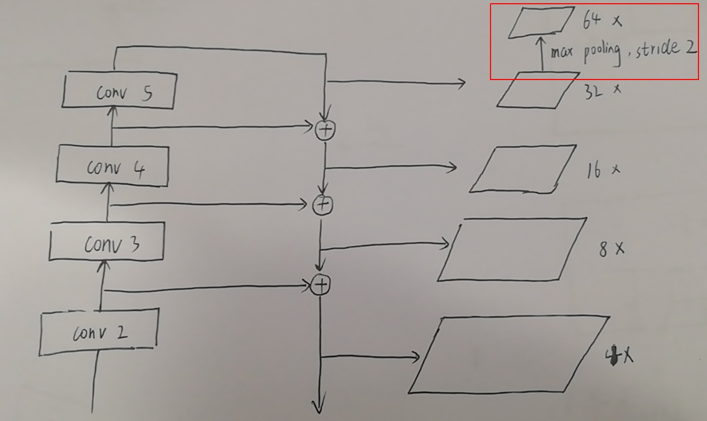

# Feature Pyramid Network (FPN)

## Idea

文章的思路很简单，就是利用好CNN本身具有的层级特征，低层阶段特征语义信息比较粗糙但是分辨率高，高层阶段特征语义信息比较显著但是分辨率低，FPN构建金字塔池化特征层，以检测不同大小的物体。

其实利用不同层级特征的思路已有论文做过了，本文的不同点在于**FPN的每个层级的池化特征都会产生预测，而不是简单的融合以后利用其中一层进行预测**

其实论文给的这个图不是很清晰地表明具体的操作，应该画成3列比较明确一点。

真正涉及的操作应该分为3步（红色的1和3有参数，而黄色的2没有参数）：

1. 对骨干网络不同阶段的特征进行侧向的1x1卷积操作，该操作把不同阶段的特征统一压缩为256通道，以便接下来的相加操作。

2. 接着是top-down的操作，**这个步骤没有涉及到有参数的的操作**，只是简单的把上一阶段的侧向输出上采样两倍（最近邻）然后跟当前阶段的特征相加，从顶至下。

3. 因为叠加了不同层级的网络特征，为了更好地适配接下来的检测任务，这一步又添加了一层3x3的卷积操作，不过不改变图谱的维度，右边的平行四边形就是最终用于检测任务的特征，RoI pooling池化操作就是作用在这些特征上的。

   > 作者在论文里提到添加3x3的卷积是为了减轻aliasing effect，这个不知道具体是什么，是由于上采样导致的锯齿效应？

注意：

- 这里涉及的1x1和3x3的卷积操作都没有使用激活函数，比较奇怪，原论文说加不加影响不大；
- 另外，1x1和3x3的卷积操作都是独立的，不共享权重

## 实现

原文给出了如何在RPN和Fast-RCNN上使用FPN架构。

### RPN

为了检测更大的物体，FPN论文还在原有卷积网络4个阶段的输出下添加了一个步长为64的池化层（下图的红框），简单地通过max pooling下采样2倍即可得到。下图每个输出图谱都称为一个level，特征一般用$\{P_2,P_3,P_4,P_5,P_6\}$表示。由于FPN已经针对物体的尺度不宜进行了建模，所以没必要在每个level都采用不同尺度的anchor，而可以把不同尺度的anchor分配给每个level，即$\{32^2,64^2,128^2,256^2,512^2\}$，长宽比例仍然使用$\{1:2,1:1,2:1\}$。每个anchor仍然按照原有Faster-RCNN的分配原则指定标签，这里说明一下，不需要显示的计算每个GT box分配给了哪个level，而只需要知道GT box跟哪个anchor关联即可，而anchor是在不同的level上的，这样就间接地把GT分配到了不同的level上。**注意特征$P_6$在第二阶段的物体检测中没有使用，只是用来提取proposal**

### Fast-RCNN

有了proposal，需要将proposal分配给特定的level，以在指定的level上进行ROI pooling操作，原文按照如下公式进行proposal的分配：
$$
\begin{align}
k &= \lfloor k_0 + \log_2(\sqrt{wh}/224)\rfloor \\
k_0 &= 4
\end{align}
$$
接下来的架构为：

​                                                                  --> cls

RoI Pooling (7 x 7) --> (1024 fc) *2 --> 

​                                                                  --> reg

