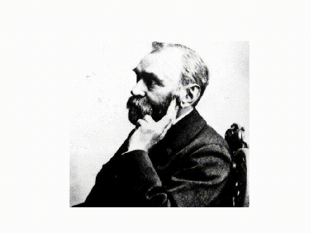

# Python Animation with Matplotlib

直接上例子，制作一个简单的图片转换特效：



代码：

```python
import numpy as np
import matplotlib.pyplot as plt
import matplotlib.animation as animation

from PIL import Image


class FrameUpdater:
    T_MAX = 100
    A_MAX = np.pi * 2

    def __init__(self):
        self.i1 = np.array(Image.open('./images/lena.jpg'))
        self.i2 = np.array(Image.open('./images/nber.jpg'))

    def __call__(self, i, handler):
        t = i % self.T_MAX
        if t == 0:
            self.i1, self.i2 = self.i2, self.i1
        h, w = self.i1.shape[:2]
        ym, xm = h // 2, w // 2
        x = np.arange(w).reshape((1, w))
        y = np.arange(h).reshape((h, 1))
        a = np.arctan2(-(y - ym), x - xm)
        a[a < 0] += 2*np.pi
        theta = t / self.T_MAX * self.A_MAX
        m = a[..., None] < theta
        img = m * self.i1 + (1 - m) * self.i2
        handler.set_data(img)
        return handler,


def main():
    updater = FrameUpdater()
    fig = plt.figure()
    h = plt.imshow(updater.i1)
    plt.axis('off')
    ani = animation.FuncAnimation(fig, updater, fargs=(h,), interval=50, blit=True)
    plt.show()


if __name__ == '__main__':
    main()
```

代码最主要的是：

```python
ani = animation.FuncAnimation(fig, updater, fargs=(h,), interval=50, blit=True)
```

官网里的例子还指定了一个`frames`参数，即：

```python
ani = animation.FuncAnimation(fig, updater, 25, fargs=(h,), interval=50, blit=True)
```

那个25传递给了`frames`参数，如果我们不指定，就默认使用的是`itertools.count`，即传入一个无限递增的迭代器。一般你要保存这个动画的时候就可以传入这个参数，表明你只希望保存这么多帧图像。可以用下面的代码取保存：

```python
def main():
    updater = FrameUpdater()
    fig = plt.figure()
    h = plt.imshow(updater.i1)
    plt.axis('off')
    # save 200 frames
    ani = animation.FuncAnimation(fig, updater, 200， fargs=(h,), interval=50, blit=True)
    ani.save('ok.mp4')
```


这个迭代器产生的值就是传递给`updater`的第一个参数，即`__call__`里的第一个参数`i`。我们还可以通过`fargs`参数传递额外的参数，比如这里的一个handler。注意你自己的updater应该要返回更新了的那些updater，这样才会被刷新。

> 所以要使用matplotlib提供的动画API，关键是实现自己的updater，这个updater是一个callable，并且第一个参数一般是表明是第几帧。

# Personal Experience

- 场景1：你想画损失函数随时间的动态图。一点要注意，记得把`xlim`和`ylim`设置到指定的区间，不然是显示不出动态图的。

  ```python
  n_steps = 200
  updater = FrameUpdater(X)
  fig, axes = plt.subplots(1, 2, figsize=(8, 4))
  
  h1 = axes[0].scatter(X[:, 0], X[:, 1], c=y)
  axes[0].axis('equal')
  
  h2, = axes[1].plot([], [])
  axes[1].set_xlim([0, n_steps])
  axes[1].set_ylim([-310, -270])
  axes[1].set_title('Log likelyhood.')
  
  ani = animation.FuncAnimation(fig, updater, fargs=(h1, h2), interval=100, blit=True, frames=n_steps)
  HTML(ani.to_html5_video())
  ```

  